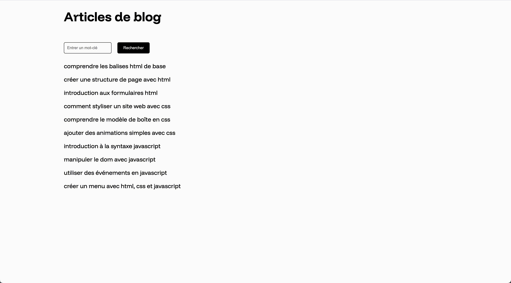

# Exercice JavaScript 3

## Installation

1. Cloner le repository
2. Ouvrir le dossier avec Visual Studio Code
3. Ouvrir une fenêtre de terminal dans Visual Studio Code et entrer la commande suivante :

```bash
npm install
```

## Travail

Depuis le terminal, entrer la commande suivante :

```bash
npm run dev
```

## Consigne

Faire en sorte que l'on puisse rechercher dans les articles de blog, comme sur la vidéo ci-dessous. Pour cela, suivre les étapes suivantes :

1. Créer 3 variables contenant les éléments suivants : Le champ texte du formulaire, le bouton du formulaire, les articles.
2. Créer une fonction et l'appeler lorsqu'on clique sur le bouton du formulaire.
3. Dans cette fonction, créer une variable contenant la valeur du champ texte, à l'aide de la propriété value. (par ex. var text = input.value)
4. Faire une boucle avec tous les articles
5. Dans cette boucle, vérifier à l'aide d'une condition si l'article contient le texte de recherche (par ex. if (article.textContent.includes(text)))
6. Si c'est le cas, afficher l'article. Sinon le cacher.

## Aperçu du résultat


